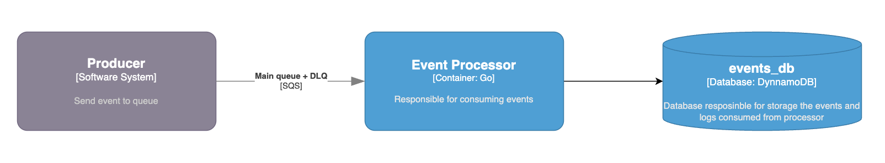

# Event Processor – Golang

Worker responsible to process events from multi producers

## Overview

This project implements an Event Processor service written in Golang, designed to consume, validate, triage, and persist events produced by multiple systems in a multi-tenant environment.

The service is reactive, consumes events from a messaging system (Amazon SQS), validates them using declarative contracts, classifies them (triage), and persists them for later delivery by downstream services.

The focus of this implementation is simplicity, clarity, testability, and reproducibility, following the requirements of the challenge.

## High-level Architecture



## Project Architecture

```
event-processor/
├── cmd/
│   ├── worker/
│   │   ├── main.go
├── infra/
│   ├── terraform/
├── internal/
│   ├── adapters/
│   │   ├── sqs/
│   │   └── dynnamo/
│   ├── app/
│   │   ├── processor.go
│   ├── config/
│   │   └── entities/
│   └── domain/
│   │   ├── event.go
│   └── ports/
│   │   ├── consumer.go
```

## Run project

### Run locally

```bash
# Install dependencies
go mod tidy

# Run server
go run main.go
```

### Run Tests

```bash
go test ./...
```

### Run Environmnent

```bash
brew install localstack/tap/localstack-cli

docker-compose up -d

pip install terraform-local

brew tap hashicorp/tap
brew install hashicorp/tap/terraform

cd infra/terraform

tflocal init

tflocal apply
```